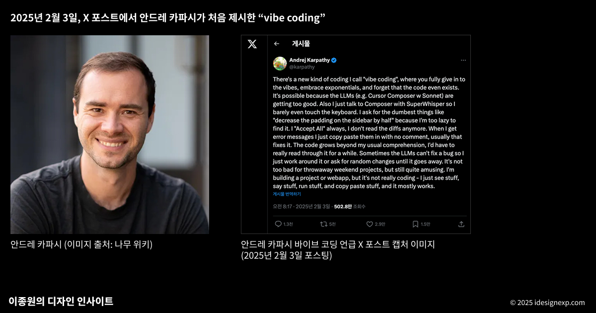

# 3. 주요개념

## A. RAG

- Retrieval-Augmented Generation, 줄여서 RAG는 AI 언어 모델이 외부 지식 기반을 참조하여 답변을 생성하는 구조
- 전통적인 LLM은 학습된 데이터만을 기반으로 응답하지만 RAG는 (1) 질의에 관련된 정보를 외부 문서나 데이터베이스에서 가져오고 (2) 검색된 정보를 바탕으로 답변을 생성.
- 효과: 정확도 향상 (외부사실에 기반하므로 환각문제 최소화), 최신성 확보 (학습 이후 업데이트된 정보도 실시간 반영가능), 특정분야 대응성 강화 (기업문서나 전문 도메인자료를 응답에 활용할 수 있음.)

| 구분            | 내용                                                                 |
|-----------------|----------------------------------------------------------------------|
| **RAG 이전**     | - 모델은 학습된 파라미터 안에서만 답변 가능 - 최신 정보 반영 어려움  - 특정 도메인 전문 지식 부족 - "죄송하지만 2021년 9월 이후의 데이터는 모릅니다."라는 한계 |
| **RAG 이후**     | - "내가 올린 문서에서 관련 부분 찾아 요약해줘" → 벡터DB에서 검색 후 LLM이 결합해 답변  - "최신 논문 내용을 반영해 설명해줘" → 외부 지식베이스 + 모델 결합으로 최신성 확보  - "우리 회사 데이터 기준으로 리포트 작성해줘" → 사내 문서/DB 연동해 맞춤형 응답 생성 |

## B. 바이브코딩

 - Andrej Karpathy가 2025년 2월에 대중화한 인공 지능 지원 소프트웨어 개발 기술
 - 개발자가 프로젝트나 작업을 대규모 언어 모델 (LLM)에 설명하면, LLM은 프롬프트 를 기반으로 코드를 생성
 - 개발자는 코드를 검토하거나 수정하지 않고, 도구와 실행 결과만을 사용하여 코드를 평가하고 LLM에 개선 사항을 요청
 - 바이브 코딩 옹호자들은 이를 통해 아마추어 프로그래머 조차도 소프트웨어 엔지니어링에 필요한 광범위한 교육과 기술 없이 소프트웨어를 생산할 수 있다고 말함

*Examples*

- <https://www.youtube.com/shorts/cOM_iR1wsQ8>
- <https://www.youtube.com/shorts/CFvpagumlv0>

## C. MCP

- Model Context Protocol (MCP)은 AI 어시스턴트가 외부 데이터 소스와 도구에 안전하고 통제된 방식으로 접근할 수 있도록 하는 개방형 표준 프로토콜을 의미.
- MCP는 AI 모델과 외부 시스템 간의 표준화된 인터페이스를 제공. 이를 통해 AI는 파일 시스템, 데이터베이스, 웹 API, 비즈니스 시스템 등 다양한 컨텍스트 소스에 접근할 수 있음.

*Examples*

- <https://www.youtube.com/shorts/XPACEy2JlOk>

| 구분            | 내용                                                                 |
|-----------------|----------------------------------------------------------------------|
| **MCP 이전** | - ChatGPT: "저는 당신의 이메일을 볼 수 없어서..." - Claude: "제가 당신의 캘린더에 접근할 수 없어서..." - Gemini: "죄송하지만 개인 파일은 확인할 수 없습니다..." |
| **MCP 이후**       | - "지난 3개월간 가장 중요했던 이메일 10개 요약해줘" → Gmail MCP 서버가 실제 이메일 데이터 분석  - "내일 회의 준비를 위해 관련 문서들 정리해줘" → Calendar + Drive + Slack MCP가 연동되어 완벽한 브리핑 생성  - "이번 프로젝트 진행상황을 팀에게 보고서로 만들어줘" → Jira + GitHub + 내 작업 로그를 종합한 자동 리포트 |

## D. Agentic Coding
- 에이전틱 코딩은 AI 에이전트가 자율적으로 코딩 작업을 수행하는 패러다임. 단순히 코드 생성을 넘어서, 계획 수립부터 실행, 테스트, 디버깅까지 전체 개발 과정을 AI가 주도적으로 처리.
- ChatCPT에게는 답을 물어볼 수 있고, Claude Code에게는 일을 시킬 수 있다.

---

`-` 제가 이해한 에이전틱 코딩

- 사건: 제 연구실에 있던 정수기에서 물이 샜습니다. 

::: {.panel-tabset}

#### 대화1
{height="1000px"}

#### 대화2
{height="1000px"}

#### 대화3
{height="1000px"}

#### 대화4
{height="1000px"}

:::

***에이전틱 코딩의 활용***

`예제` -- 관심있는 연구논문 정리

::: {.panel-tabset}

#### 이메일1
{height="400px"}

#### 이메일2
{height="400px"}

#### 동영상


:::

# 4. AI활용에 대한 비판

## A. 바이브코딩에 대한 비판

- Programmer Simon Willison (바이브코딩 옹호자) said:

> "If an LLM wrote every line of your code, but you've reviewed, tested, and understood it all, that's not vibe coding in my book—that's using an LLM as a typing assistant."

- 저의 생각: 아무리 바이브 코딩이 좋다고 해도 사이먼 윌리슨의 발언은 좀 과하지 않나??

*Examples*

- <https://www.youtube.com/shorts/NXIIqHXWsTk>
- <https://www.youtube.com/shorts/KzewB6tX8p8>

## B. Francis Geng의 연구

- Francis Geng 연구팀은 "바이브 코딩(Vibe Coding)"이라는 새로운 프로그래밍 워크플로우에서 학생들이 AI 도구와 어떻게 상호작용하는지, 그리고 이러한 상호작용이 프로그래밍 경험 수준에 따라 어떻게 다른지 조사하였음 @geng2025exploring

- 실험설계: 연구에는 **북미 연구 중심 대학의 두 컴퓨터 과학 강좌에서 모집된 총 19명의 학생**이 참여했음: 초급 프로그래밍(CS1) 과정 학생 9명과 고급 소프트웨어 공학(SWE) 과정 학생 10명. 모든 참가자는 브라우저 기반 AI 통합 IDE인 **Replit 플랫폼을 사용하여 개인 예산 관리 웹 애플리케이션을 구축하는 개방형 과제**를 수행.

**발견1**: 학생들은 대부분의 시간을 AI가 만든 프로토타입을 테스트하는데 사용함.

---

- 학생들이 가장 많이 한 활동은 프로토타입 상호작용임. (64%) 즉, "내가 만든 앱이 제대로 돌아가는가?" 확인하는데 쓰였음.
- 두번째로 많이 한 행동은 프롬프트 작성 (21%):
    - 심지어 프롬프트를 작성한 이유 중 가장 많은것은 새기능 요청이 아니라 디버깅 요청임 (61%)^[결국 AI를 이용하여, AI가 만든 버그를 고치는 일을 하는것에 더 많은 시간을 쓰는 셈, 한마디로 바이브코딩이 아니라 바이브디버깅]
- 실제 코드를 짜거나 들여다보고 고치는데 쓴 시간은 거의 없었음. (7%)
    - 이마저도 90.37%는 단순 코드 해석에 투자하였으며,
    - 직접적인 코드 수정은 9.63%에 불과했음.^[당연한 이야기이긴한데, 바이브코딩 환경이 학습자와 코드를 멀어지게 만드는 효과가 있음]

---

**발견2**: 초보자와 숙력자의 차이 (프로프트 작성 능력의 차이)

---

## C. 왼쪽길을 지지하는 사람들의 의견

- AI시대 코딩에 필요한 역량을 요약하면 아래와 같음:
    - 테스트 & 디버깅
    - 풍부한 맥락의 프롬프팅: 기술적 정확성으로 문제를 설명하는 능력
    - 코드 이해력: AI 결과물을 이해하는 기술

- 쉽게 말하면, 코딩 할 줄 알아야 한다는 의미.

# 제 의견(?)

## 테서렉트

- <https://www.youtube.com/shorts/U4QGN1sNytA>
- <https://www.youtube.com/shorts/A-S9Y3qi2hM>
- <https://www.youtube.com/watch?v=j-ixGKZlLVc>
